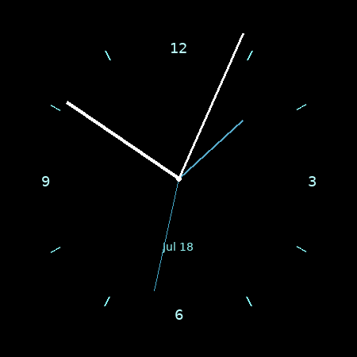

# Galaxy Simple Analog Event

A simple analogue watch face for the Samsung Galaxy Watch 7 (Wear OS 5, Watch
Face Format v2).



## Design

- **Dial:** pure-black background with eight small hour ticks and modest
  numerals at 12, 3, 6, and 9 (replacing ticks at those positions).
- **Main hands:** white hour and minute hands (no seconds) centred on a small
  cap.
- **Date (slot 1):** system `DATE` complication centred above the 6 o'clock
  numeral.
- **Next event (slot 2):** defaults to the system `NEXT_EVENT` provider, which
  aggregates calendar entries, timers, alarms, and similar scheduled items.
  The event start time is shown as a pair of dim cyan ghost hands, lighter and
  shorter than the main hands, sitting beneath them on the dial. Users can
  change the provider in the watch-face editor (`Editable` is enabled).

## Always-on display / battery optimisation

- Pure black (`#ff000000`) background.
- No seconds hand (avoids per-second redraws).
- Main hands are slightly dimmed in ambient (`alpha` 210).
- Event ghost hands are very faint in ambient (alpha 40–45).
- Vector ticks and text only — no large bitmaps.

## Benchmark

Run `python3 scripts/benchmark.py` from the repo root; results are written to
`benchmark.json`. Wear OS limits: 10 MB ambient / 100 MB interactive.

## Build / validate

```bash
./gradlew :faces:simple-analog-event:assembleDebug
./gradlew :faces:simple-analog-event:lintDebug
./scripts/wff-validate.sh 2
python3 scripts/benchmark.py
```

## Notes on event hands

Event hands use the `NEXT_EVENT` complication slot (slot 2) with scene-level
`PartDraw` ghost hands driven by `[COMPLICATION.2.HOUR_*]` /
`[COMPLICATION.2.MINUTE_*]` expressions when an event is present. Grant calendar
permission when prompted so the system provider can supply data. On-device
verification on a Galaxy Watch 7 is recommended because the WFF complication
time context is evaluated by the Wear OS renderer.
