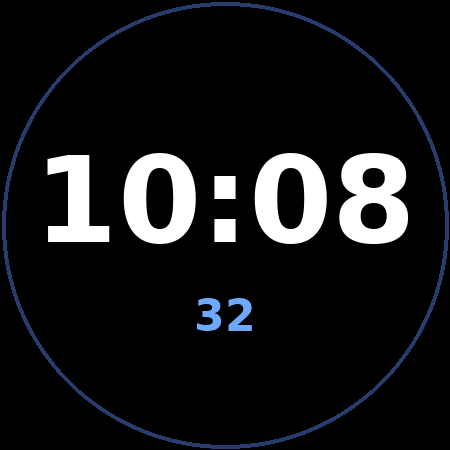

# Galaxy Simple Digital

A minimal digital watch face for the Samsung Galaxy Watch 7 (Wear OS 5, Watch
Face Format v2). It is the repository's starter template.



## Design

- Bold `HH:MM` centered, respecting the device 12/24-hour setting (`SYNC_TO_DEVICE`).
- A small seconds readout below the time, shown only in interactive mode.
- Pure black background (`#ff000000`) so unused OLED pixels stay off.

## Always-on display / battery optimisation

- **Background is pure black** — black OLED pixels draw ~no power.
- **Seconds are hidden in ambient mode** (`Variant` drives alpha to 0), avoiding
  per-second redraws that burn battery.
- **Ambient time uses a THIN weight and a dimmed colour**, lighting fewer/less
  intense pixels than the interactive bold white.
- No images or bitmap fonts, so the ambient memory footprint stays tiny.

## Benchmark

Memory footprint (the Wear OS battery/AOD proxy used by Google Play) is measured
by `scripts/benchmark.py` and recorded in `benchmark.json`. Limits are 100 MB
interactive / 10 MB ambient.

## Build / validate

```bash
./gradlew :faces:simple-digital:assembleDebug   # build APK
./scripts/wff-validate.sh 2                      # validate WFF XML
python3 scripts/benchmark.py                      # measure memory footprint
```
